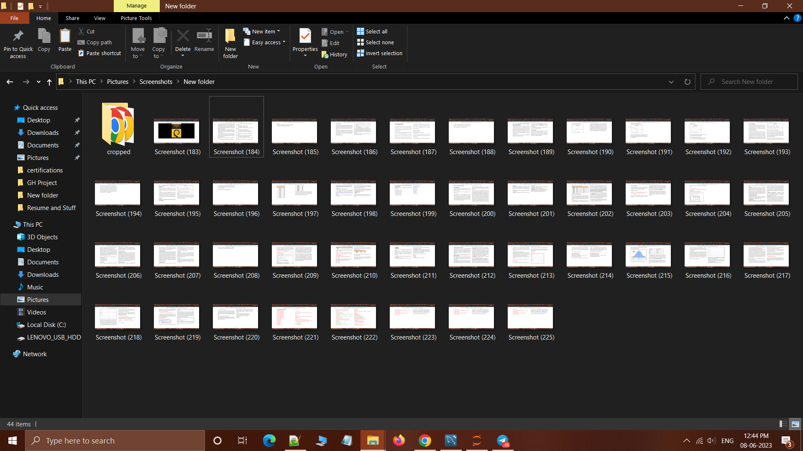
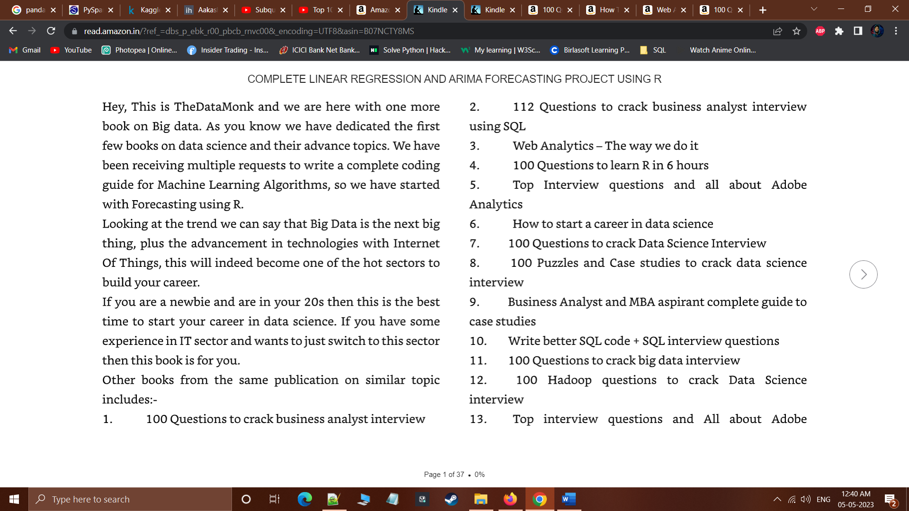
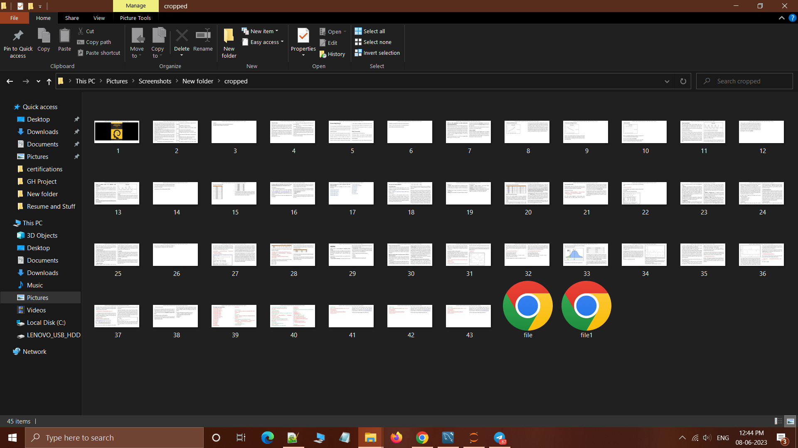

# Images-crop-automation
This Python scripting project automates the task of cropping all the images in  a directory and creating a pdf of those images.
Title: Image Cropping and PDF Generation Script

#Description:
The Image Cropping and PDF Generation Script is a Python script that provides a comprehensive solution for automating the cropping
of images in a specified directory and generating a PDF document containing the cropped images.
This script streamlines your image processing workflow, allowing you to create professional-looking PDF documents quickly and efficiently.

##Key Features:
Image Cropping: The script utilizes advanced computer vision techniques to automatically crop images in the specified directory.
Batch Processing: The script efficiently processes multiple images in a single run. It automatically detects and crops each image, saving you valuable time and effort.
Image Quality Preservation: The script takes precautions to preserve the quality of the cropped images. It creates copies of the original files and performs the cropping operations on the duplicates, ensuring that the original images remain intact.
PDF Generation: After cropping the images, the script compiles them into a single PDF document. The cropped images are sequentially arranged in the PDF, maintaining their original order. This feature is particularly useful for creating presentations, portfolios, or documents that require a collection of cropped images.
User-friendly Interface: The script provides a user-friendly command-line interface, guiding you through the image cropping and PDF generation process. It offers clear instructions and prompts to ensure a smooth and hassle-free experience.

#Use Case
Use Case for this tool arose when I was going through my scrrenshot folder, and found all the images had taskbar and window options and msot unnecessary things in the screenshot.
There were almost 200+ images in the Folder which needed proper crops and resize viz dimensions.

#Feature:

This tool scans the Directory:

It picks up the uncropped image:

and crops the image wrt dimension configured

and creates cropped images in a new directory

